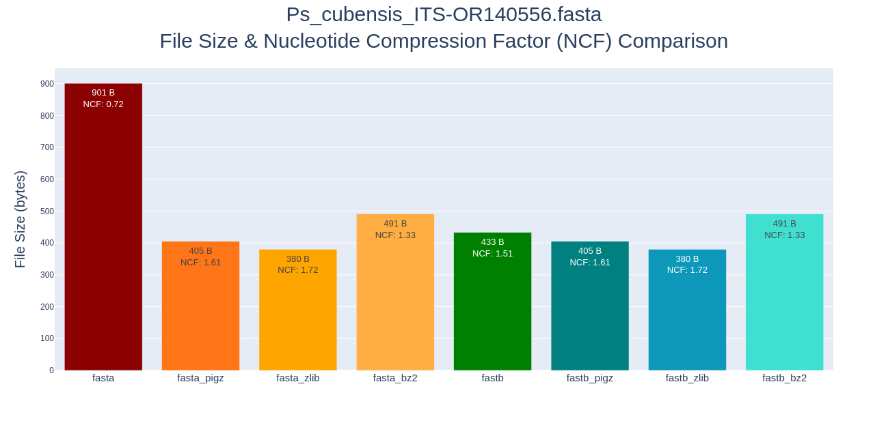
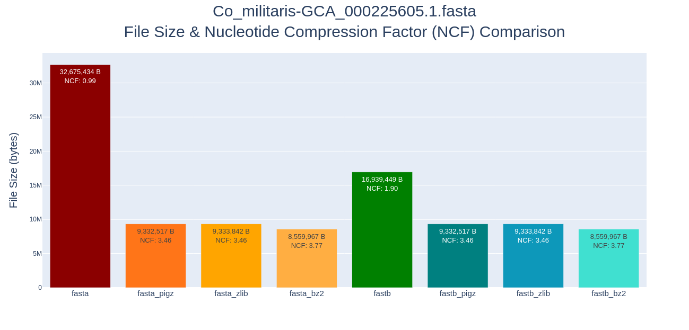

  

# FASTB — Binary Nucleotide Encoding (v2.1)

**FASTB** is a binary file format for storing nucleotide sequence data from FASTA in a more **size-efficient** and **CPU-friendly** way.  

Instead of encoding nucleotides as ASCII characters (8-bits each), FASTB stores them in compact 2-bit, 3-bit, or 4-bit encodings depending on the sequence complexity.  

---

## Why FASTB Matters

FASTA files are simple and human-readable, but they are **inefficient** for computational workflows:

- **High storage overhead**: Each base takes 8 bits in ASCII, even though only 4–16 symbols are used.
- **CPU waste**: Every FASTA compression and decompression requires resources and time.
- **Poor I/O performance**: More disk space → more read/write operations → more time spent loading data.

FASTB solves these issues by storing nucleotides in binary directly — meaning:

1. **Smaller file sizes without compression**
   - Typical genome FASTA → FASTB reduction: ~60–75% in size  
   - No gzip/bzip2 decompression step needed

2. **Faster I/O throughput**
   - Hypothetical gain:  
     - If your pipeline spends 20% of runtime loading/parsing FASTA,  
       and binary load is ~4× faster, total runtime could drop by **5–10%**.

3. **Reduced RAM footprint**
   - Less memory needed to store sequences in memory buffers.

4. **Improved data locality**
   - Binary storage aligns more closely with CPU cache line sizes.

5. **Built-in encoding flexibility**
   - Can represent confidence levels and degenerate bases without extra storage cost.

---

## Encoding Modes

FASTB supports three encoding schemes depending on the input sequence:

### 1. **Simple Encoding** — Diad (2 bits / nucleotide)
For uppercase ATCG(U) only.
| ASCII Binary (8-bit) | Binary Diad (2-bit) | Base | Description |
|----------------------|---------------------|------|-------------|
| 01010100 | 00 | T | Thymine |
| 01010101 | 00 | U | Uracil |
| 01000001 | 10 | A | Adenosine |
| 01000011 | 01 | C | Cytosine |
| 01000111 | 11 | G | Guanine |

First bit = Purine/Pyrimidine, Second bit = Hydrogen bonds (2→0, 3→1).

---

### 2. **Confidence Encoding** — Triad (3 bits / nucleotide)
For upper/lowercase ATCG(U), where case = confidence level.
| ASCII Binary | Binary Triad | Base | Description |
|--------------|--------------|------|-------------|
| 01010100 | 000 | T | Thymine (high) |
|            | 100 | t | Thymine (low) |
| 01010101 | 000 | U | Uracil (high) |
|            | 100 | u | Uracil (low) |
| 01000001 | 010 | A | Adenosine (high) |
|            | 110 | a | Adenosine (low) |
| 01000011 | 001 | C | Cytosine (high) |
|            | 101 | c | Cytosine (low) |
| 01000111 | 011 | G | Guanine (high) |
|            | 111 | g | Guanine (low) |

First bit = Confidence (1 high, 0 low), remaining bits = Diad code.

---

### 3. **Degenerate Encoding** — Tetrad (4 bits / nucleotide)
Supports IUPAC degenerate codes.
| ASCII Binary (8-bit) | Binary Tetrad (4-bit) | Representative Character | Description |
|----------------------|-----------------------|--------------------------|-------------|
| 01011111 | 0000 | - | Dash
| 00100000 | 0000 |   | Blank
| 01010100 | 0100 | T | Thymine
| 01010101 | 0100 | U | Uracil
| 01000001 | 1000 | A | Adenosine
| 01000011 | 0010 | C | Cytosine
| 01000111 | 0001 | G | Guanine
| 01010111 | 1100 | W | A/T
| 01010011 | 0011 | S | C/G
| 01001101 | 1010 | M | A/C
| 01001011 | 0101 | K | G/T
| 01010010 | 1001 | R | A/G
| 01011001 | 0110 | Y | C/T
| 01000010 | 0111 | B | Not A
| 01000100 | 1101 | D | Not C
| 01001000 | 1110 | H | Not G
| 01010110 | 1011 | V | Not T
| 01001110 | 1111 | N | Any

Each bit position corresponds to presence/absence of A, T(U), C, G.

---

## Example: Storage Savings

Sequence `"TACG"` in ASCII: 01010100 01000001 01000011 01000111 (32 bits total)

Binary Tetrad encoding: 0100 1000 0010 0001 (16 bits total)

Binary Diad encoding: 00 10 01 11 (8 bits total)

**Reduction:** From 32 bits → 8 bits (75% smaller).

### Example Short-Sequence (i.e. single fungal ITS)

  

### Example Long-Sequence (i.e. full fungal genome)

  

---

## v2.1 Updates

- **Refined encoding marker system**  
  - Now each record has an explicit encoding marker for decoding without guessing.
- **Improved I/O pipeline**  
  - Sequential read/write optimizations.
- **Error handling**  
  - Rejects unsupported amino acid FASTA files with a clear message.
- **Cleaner separation** of metadata, encoding marker, sequence, and record terminator.
- **Standalone Editor** usefule for pulling out or saving sequences for use in other applications; client side and via PyQt5-interface.
- **HTML Implementation** usefule for pulling out or saving sequences for use in other applications; client side and on via web-interface.

---

## Planned Expansion

- **FASTQ (Illumina)** with integrated quality score encoding  
- **FAST5 (Nanopore)** sequence embedding  
- **Image-based storage**: Encode nucleotide bits directly into RGBA pixel channels for steganographic + redundant data storage.

---

## License

MIT License — see [LICENSE](LICENSE) for details.
